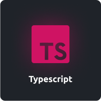
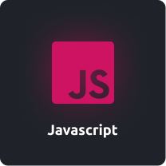
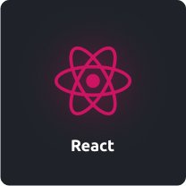
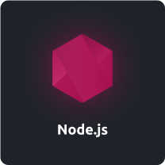

# **Rafael Angonese**

- A Front-end developer from Brazil 🚀.

- Creating worlds with letters and numbers 🌍.

- I'm fascinated by technology and nature 🌊.

- Currently, I'm a final year student pursuing Bachelors's in Computer Science 🎓 from Unochapeco University 🏛.

- 🌱 🚀 ❤️ Interested and Learning all about Front-end

---

# 🔮 **Tech Stack**

 

  
  
  
  
  

 

 

  <a href="https://github.com/rafael-angonese">
  

  

---

# 👣 **Next Steps**

- ❤️ Connect with me

---

### Change the language

