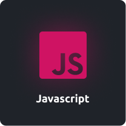

# **Rafael Angonese**

- Full-stack focado em Front-end 🚀.

- Criando mundos com letras e números 🌍.

- Eu sou fascinado pela tecnologia e natureza 🌊.

- Atualmente, eu estou no último ano do curso de Ciência da Computação 🎓 na universidade Unochapecó 🏛.

- 🌱 🚀 ❤️ Interessado e aprendendo tudo sobre Front-end.

---

# 🔮 **Tecnologias**

 

  
  
  
  
  

 

 

  <a href="https://github.com/rafael-angonese">
  

  

